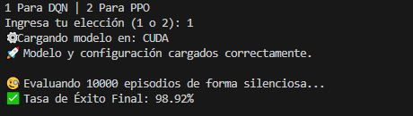
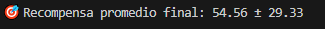

# HoneySat's Satellite Simulator + Detumbling RL


Este repositorio parte del simulador de satélite **HoneySat** (SUCHAI-2) y lo extiende con un
entorno de **aprendizaje por refuerzo** para resolver el problema de **detumbling** (frenado de
la rotación descontrolada de un CubeSat tras su despliegue), usando ruedas de reacción como
actuador. Se implementan y comparan tres familias de agentes:

- **Métodos tabulares**: Q-learning y SARSA con discretización del espacio de estados.
- **Deep Q-Network (DQN)**, usando `stable-baselines3`.
- **Proximal Policy Optimization (PPO)**, usando `stable-baselines3`.

La búsqueda de hiperparámetros de todos los agentes se realiza con **Optuna**.

## Tabla de contenidos

- [Getting Started](#getting-started)
- [Estructura del proyecto](#estructura-del-proyecto)
- [Simulador base](#simulador-base)
- [Entorno de RL: detumbling del CubeSat](#entorno-de-rl-detumbling-del-cubesat)
- [Entrenamiento de agentes](#entrenamiento-de-agentes)
- [Evaluación de modelos](#evaluación-de-modelos)
- [Resultados obtenidos](#resultados-obtenidos)
- [Monitoreo con TensorBoard](#monitoreo-con-tensorboard)
- [Research Paper](#scroll-research-paper)
- [License](#warning-license)
- [Acknowledgements](#gem-acknowledgements)

## Getting Started

### Dependencies

> IMPORTANT: Python <3.13 es requerido

```bash
python -m venv env
source env/bin/activate
pip install -r requirements.txt
```

También se incluye [`environment.yml`](environment.yml) para crear el entorno con conda
(Python 3.11):

```bash
conda env create -f environment.yml
conda activate honeysat-api-dev-env-p11
```

Download the igrf14coeffs.txt file from:  https://www.ngdc.noaa.gov/IAGA/vmod/coeffs/igrf14coeffs.txt
and place it in `env/lib/<PYTHON-VERSION>/site-packages/pyIGRF/src/igrf14coeffs.txt`

```shell
mkdir -p <PYTHON_PATH>/site-packages/pyIGRF/src/
cp assets/igrf14coeffs.txt <PYTHON_PATH>/site-packages/pyIGRF/src/igrf14coeffs.txt
```

<!-- Env Variables -->
### :key: Environment Variables

To run this project, you will need to add the following environment variables to your .env file

```
MONGO_DB_NAME
MONGO_USER_NAME
MONGO_PASSWORD
MONGO_IP
MONGO_PORT
GROUND_STATION_LAT
GROUND_STATION_LON
SATELLITE_NAME_TLE
SATELLITE_NORAD_CATALOG_NUMBER
```

`SATELLITE_NAME_TLE` y `SATELLITE_NORAD_CATALOG_NUMBER` se usan para descargar el TLE del
satélite desde donde se obtienen los parámetros orbitales (por ejemplo, ver los TLE de ejemplo
en [TLE_and_data/](TLE_and_data/)). Las variables `GROUND_STATION_*` definen la ubicación de la
estación terrena usada por la simulación orbital.

### Run

```bash
source .env
python main.py
```

Esto levanta el simulador base (rotación, órbita, campo magnético, energía y subsistemas) y lo
expone vía [Interfaces/ZMQInterface.py](Interfaces/ZMQInterface.py).

## Estructura del proyecto

```
Simulations/            Dinámica física: rotación, órbita, campo magnético, energía, térmica
Sensors/                Sensores simulados (giroscopio, magnetómetro, sol, GPS, cámara, etc.)
SubsystemsStates/       Estados de subsistemas del satélite (ADCS, EPS, COMM, Payload)
SatStates/              Estado agregado del satélite (SUCHAI-2)
Interfaces/             Interfaz ZMQ para exponer el estado del simulador
SatellitePersonality.py Parámetros físicos y de configuración del satélite simulado

cubesat_detumbling_rl.py   Entorno Gymnasium (CubeSatDetumblingEnv) para el problema de detumbling
Metodos_Tabulares.py       Implementación de Q-learning / SARSA tabular
MetTabularOptuna/          Búsqueda de hiperparámetros (Optuna) para SARSA + entrenamiento final
train_qlearning_agent.py   Script de entrenamiento/evaluación de Q-learning tabular
DeepDQN.py                 Entrenamiento DQN + búsqueda de hiperparámetros con Optuna
DeepDQNActions.py           Variante DQN con espacio de acciones extendido (micro/medio/alto torque)
DeepDQNActionsVel.py        Variante DQN con features de velocidad angular adicionales
DeepDQNActionsVelMIO.py      Variante DQN (ajustes propios) con espacio de acciones y observación extendidos
Deep.py                     Entrenamiento PPO + búsqueda de hiperparámetros con Optuna
evaluar_modelos.py           Evaluación comparativa de modelos DQN/PPO entrenados
pruebas.py                   Pruebas / evaluación batch de un modelo entrenado

logs_dqn_detumbling/     Logs de TensorBoard + configuraciones de cada iteración de DQN
logs_ppo_detumbling/     Logs de TensorBoard de las corridas de PPO
models_dqn_detumbling/   Modelo DQN final + configuración óptima (best_config.json)
Resultados DQN/          Capturas de evaluación y modelo final usados para el hito de entrega
q_table.pkl              Q-table de ejemplo entrenada con Q-learning tabular

TestsAndExamples/        Ejemplos y pruebas del simulador base (sensores, ZMQ, órbita, etc.)
utils/                   Utilidades (cliente de base de datos, logger)
```

## Simulador base

El simulador (heredado de HoneySat) modela la física de un CubeSat tipo SUCHAI-2:

- **RotationSimulation**: dinámica rotacional (cuaterniones, velocidad angular, torque aplicado).
- **OrbitalSimulation**: propagación orbital a partir de un TLE (usa [Skyfield](https://github.com/skyfielders/python-skyfield)).
- **MagneticSimulation**: campo magnético terrestre (IGRF) en la posición del satélite.
- **PowerSystemSimulation** / **ThermalSimulation**: energía (usando [PyBaMM](https://github.com/pybamm-team/PyBaMM)) y temperatura.

Estos componentes se reutilizan directamente como backend físico del entorno de RL.

## Entorno de RL: detumbling del CubeSat

[cubesat_detumbling_rl.py](cubesat_detumbling_rl.py) define `CubeSatDetumblingEnv`, un entorno
[Gymnasium](https://gymnasium.farama.org/) que envuelve `RotationSimulation`, `OrbitalSimulation`
y `MagneticSimulation` para simular el problema de detumbling:

- **Observación** (10 dimensiones): cuaternión de actitud (4) + velocidad angular (3) + campo
  magnético (3).
- **Acción**: torque discreto aplicado sobre las ruedas de reacción en cada eje (X, Y, Z), en un
  `action_map` configurable (por defecto ±torque máximo por eje, o sin torque). Las variantes
  `DeepDQNActions*` amplían este mapa con niveles de micro/medio/alto torque.
- **Recompensa**: penaliza la norma de la velocidad angular (y opcionalmente el uso de acciones,
  vía `action_penalty`), premiando reducirla hasta un umbral de éxito (`success_threshold`,
  por defecto 0.01 rad/s).
- **Episodio**: termina al alcanzar el umbral de éxito o al llegar a `max_steps`.

## Entrenamiento de agentes

Todos los scripts de entrenamiento instancian `CubeSatDetumblingEnv` y guardan sus resultados en
`logs_*_detumbling/` (TensorBoard) y `models_*_detumbling/` (checkpoints + `best_config.json` con
los mejores hiperparámetros encontrados por Optuna).

### Q-learning / SARSA tabular

```bash
python train_qlearning_agent.py
```

Discretiza la velocidad angular en bins y entrena una Q-table clásica (guardada en
`q_table.pkl`). [Metodos_Tabulares.py](Metodos_Tabulares.py) contiene las funciones de
discretización de estado y entrenamiento de SARSA (`train_sarsa_td`), reutilizadas por
[MetTabularOptuna/Sarsa_Opti.py](MetTabularOptuna/Sarsa_Opti.py) para la búsqueda de
hiperparámetros con Optuna, y por
[MetTabularOptuna/onlyfinalmodel.py](MetTabularOptuna/onlyfinalmodel.py) para entrenar el modelo
final con la mejor configuración encontrada.

### DQN

```bash
python DeepDQN.py
# o alguna de las variantes:
python DeepDQNActions.py
python DeepDQNActionsVel.py
python DeepDQNActionsVelMIO.py
```

Cada script corre una búsqueda bayesiana de hiperparámetros con Optuna sobre `DQN` de
`stable-baselines3` y guarda el mejor modelo en `models_dqn_detumbling/`. Las variantes
`Actions*` difieren en el tamaño del espacio de acciones y/o en las observaciones incluidas
(por ejemplo, agregando la norma de la velocidad angular).

### PPO

```bash
python Deep.py
```

Análogo a los scripts de DQN, pero usando `PPO` de `stable-baselines3` (guardado en
`models_ppo_detumbling/`).

## Evaluación de modelos

```bash
python evaluar_modelos.py   # compara modelos DQN/PPO entrenados: tasa de éxito, pasos, recompensa
python pruebas.py           # evaluación batch (N episodios) de un modelo específico
```

Ambos scripts cargan `best_config.json` para reconstruir el `action_map` con el que se entrenó
el modelo y calculan tasa de éxito (velocidad angular final bajo el umbral), pasos promedio y
recompensa promedio/desviación estándar sobre múltiples episodios.

## Resultados obtenidos

Los resultados reportados a continuación provienen de correr `evaluar_modelos.py` sobre los
modelos ya entrenados de este repositorio, evaluando **10.000 episodios** por modelo con
`deterministic=True` y el mismo `success_threshold` (0.01 rad/s) usado en entrenamiento. Las
capturas originales están en [`Resultados DQN/`](Resultados%20DQN/) y en las carpetas de cada
iteración dentro de [`logs_dqn_detumbling/`](logs_dqn_detumbling/).

### DQN: evolución entre iteraciones

El agente DQN fue el que más iteraciones tuvo, partiendo de un `action_map` simple (torque
máximo por eje) hasta un espacio de acciones con niveles micro/medio/alto de torque y una
función de recompensa que penaliza el uso de torque. La siguiente tabla resume tres hitos
representativos, de peor a mejor:

| Iteración | Cambios principales | Tasa de éxito (10k episodios) | Recompensa promedio |
|---|---|---|---|
| `DQN_6` – con micro-torque | Se agrega el nivel de "micro torque" al `action_map` (además de min/mid/max) | **94.00 %** | — |
| `DQN_10` – red de 256 neuronas | Misma config de `DQN_6`, pero con `net_arch=[256,256]` en vez de la red por defecto | **90.53 %** | — |
| Modelo final — [`models_dqn_detumbling/best_config.json`](models_dqn_detumbling/best_config.json) / [`Resultados DQN/`](Resultados%20DQN/) | Optuna busca también `action_penalty`, `tau`, `max_grad_norm`, `buffer_size=450k` y `net_arch=[256,256]` | **98.92 %** | **54.56 ± 29.33** |

<p align="center">
  
  
</p>

El hallazgo más interesante de esta comparación es que **agrandar la red por sí sola (`DQN_10`)
empeoró el resultado** respecto a `DQN_6` (90.53 % vs. 94.00 %): la mejora real vino de que
Optuna también ajustara la penalización por acción, `tau` y el tamaño del buffer de replay
(modelo final), no solo la capacidad de la red. El modelo final en `models_dqn_detumbling/` es
el que se usa por defecto en `evaluar_modelos.py` y `pruebas.py`.

### SARSA/Q-learning tabular

[Metodos_Tabulares.py](Metodos_Tabulares.py) entrena una Q-table discretizando la velocidad
angular en 15 bins por eje; el resultado de ejemplo se guarda en [`q_table.pkl`](q_table.pkl).
[MetTabularOptuna/Evaluation.py](MetTabularOptuna/Evaluation.py) permite evaluar cualquier
Q-table guardada (carpeta `q_tables/`) con el mismo protocolo de tasa de éxito/recompensa que
DQN. Al ser un espacio de estados discretizado (en vez de observación continua), el agente
tabular converge mucho más rápido a una política razonable, pero con una política más gruesa
(menos precisa cerca del umbral de éxito) que los agentes profundos.

### PPO

El agente PPO ([Deep.py](Deep.py)) fue entrenado y quedó registrado en
`logs_ppo_detumbling/` vía TensorBoard, pero a diferencia de DQN no llegó a evaluarse con el
mismo protocolo de 10.000 episodios (no hay un modelo final de PPO guardado en este
repositorio). Para comparar PPO contra el DQN final, entrena un modelo con `python Deep.py` y
luego corre `python evaluar_modelos.py` seleccionando la opción `2`.

### Cómo reproducir estos números

```bash
python evaluar_modelos.py
# > 1 Para DQN | 2 Para PPO
# > 1
```

Esto carga `models_dqn_detumbling/dqn_cubesat_optuna_best_NUEVOS.zip` con su
`best_config.json`, corre 10.000 episodios y además grafica un episodio de ejemplo
(velocidad angular vs. torque aplicado) con `debug_and_plot_episode`.

## Monitoreo con TensorBoard

```bash
tensorboard --logdir ./logs_dqn_detumbling   # o ./logs_ppo_detumbling
```

<!-- Research Paper -->
### :scroll: Research Paper

**HoneySat: A Network-based Satellite Honeypot Framework**

If you use our work in a scientific publication, please do cite us using this **BibTex** entry:
``` tex
@inproceedings{placeholder,
  title={HoneySat: A Network-based Satellite Honeypot Framework},
  author={placeholder},
  booktitle={placeholder},
  year= {placeholder}
}
```

<!-- License -->
## :warning: License

Distributed under the MIT License. See LICENSE.txt for more information.


<!-- Acknowledgments -->
## :gem: Acknowledgements

 - [PyBaMM](https://github.com/pybamm-team/PyBaMM)
 - [Skyfield](https://github.com/skyfielders/python-skyfield)
 - [PyZMQ](https://github.com/zeromq/pyzmq)
 - [Gymnasium](https://gymnasium.farama.org/)
 - [Stable-Baselines3](https://github.com/DLR-RM/stable-baselines3)
 - [Optuna](https://optuna.org/)
