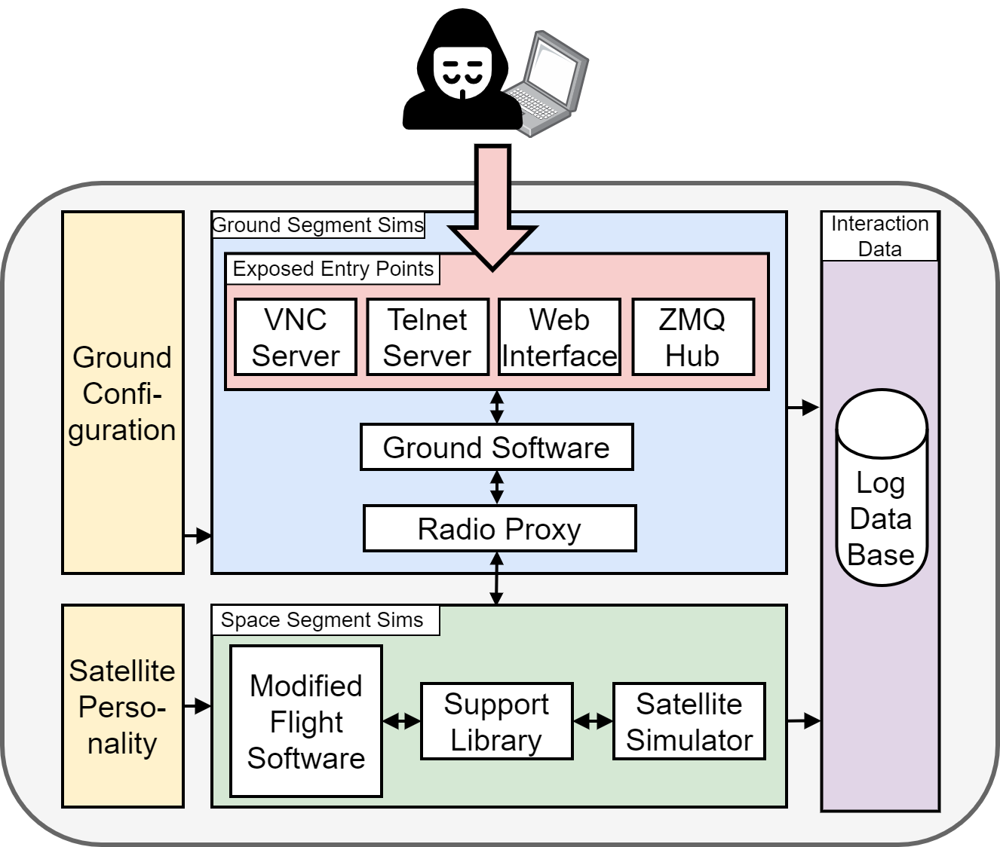

# HoneySat's Satellite Simulator



## Getting Started

### Dependencies

> IMPORTANT: Python <3.13 is required

```bash
python -m venv env
source env/bin/activate
pip install -r requirements.txt
```

Download the igrf14coeffs.txt file from:  https://www.ngdc.noaa.gov/IAGA/vmod/coeffs/igrf14coeffs.txt
and place it in `env/lib/<PYTHON-VERSION>/site-packages/pyIGRF/src/igrf14coeffs.txt`

```shell
mkdir -p <PYTHON_PATH>/site-packages/pyIGRF/src/
cp assets/igrf14coeffs.txt <PYTHON_PATH>/site-packages/pyIGRF/src/igrf14coeffs.txt
```

<!-- Env Variables -->
### :key: Environment Variables

To run this project, you will need to add the following environment variables to your .env file

```
MONGO_DB_NAME
MONGO_USER_NAME
MONGO_PASSWORD
MONGO_IP
MONGO_PORT
GROUND_STATION_LAT
GROUND_STATION_LON
SATELLITE_NAME_TLE
SATELLITE_NORAD_CATALOG_NUMBER
```

### Run

```bash
source .env
python main.py
```


<!-- Research Paper -->
### :scroll: Research Paper

**HoneySat: A Network-based Satellite Honeypot Framework** 

If you use our work in a scientific publication, please do cite us using this **BibTex** entry:
``` tex
@inproceedings{placeholder,
  title={HoneySat: A Network-based Satellite Honeypot Framework},
  author={placeholder},
  booktitle={placeholder},
  year= {placeholder}
}
```

<!-- License -->
## :warning: License

Distributed under the MIT License. See LICENSE.txt for more information.


<!-- Acknowledgments -->
## :gem: Acknowledgements

Use this section to mention useful resources and libraries that you have used in your projects.

 - [PyBaMM](https://github.com/pybamm-team/PyBaMM)
 - [Skyfield](https://github.com/skyfielders/python-skyfield)
 - [PyZMQ](https://github.com/zeromq/pyzmq)
